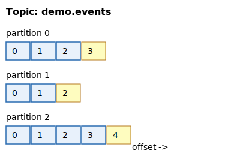

<!-- _class: lead -->

# Apache Kafka na pratica

### Topicos, particoes, offsets e consumer groups — ao vivo

Michael Sta. Helena

---

## Quem sou eu

- Engenheiro de software
- Ja usei Kafka em producao para: eventos de dominio, CDC, fan-out de notificacoes
- Hoje a ideia e desmistificar os conceitos basicos **e** mostrar funcionando

---

## O problema: acoplamento + pico + replay

- Servico A precisa avisar B, C e D que algo aconteceu
- Chamadas sincronas: se D cai, A cai junto
- Pico de trafego derruba o servico mais lento
- E se eu precisar reprocessar o historico?

> **Resposta comum:** uma fila. Mas fila tradicional apaga a mensagem depois de consumida.

---

## O que e Kafka, em 1 frase

> Um **log distribuido, particionado e append-only** — com clientes que leem por offset.

Tres consequencias:
1. Multiplos consumidores leem os mesmos dados **independentemente**.
2. Retencao e por **tempo/tamanho**, nao por consumo.
3. Escala horizontal vem de **particionar** o log.

---

## Topic

- Nome logico do stream: `pedidos.criados`, `pagamentos.aprovados`
- E so um rotulo — o dado real vive em **particoes**
- Analogia: **uma pasta no disco**; as particoes sao arquivos dentro dela

---

## Partition



- Sequencia ordenada e imutavel de mensagens
- Unidade de paralelismo e **unica garantia de ordem**
- Cada particao vira uma pasta fisica no broker:
  `kafka-data/pedidos.criados-0/`
- Dentro: segmentos `.log`, `.index`, `.timeindex`

---

## Offset

- Numero sequencial **por particao** (0, 1, 2, ...)
- Imutavel: a mensagem no offset 42 da particao 0 sera **sempre** aquela
- O **consumer** guarda onde parou (committed offset)
- Isso permite: replay, reposicionamento, multiplos consumers independentes

---

## Producer

- Escreve em um topico; escolhe a particao assim:
  - **sem key** -> round-robin / sticky batch
  - **com key** -> `hash(key) % num_particoes`
- `acks=all` + `min.insync.replicas` controlam durabilidade
- Batching (`linger.ms`, `batch.size`) e o que da o throughput

---

## Consumer & Consumer Group

- Cada consumer pertence a um **group.id**
- Kafka distribui as particoes entre os membros do grupo
- Regra de ouro:

> **Uma particao e lida por no maximo 1 consumer dentro de um grupo.**

- Paralelismo maximo = numero de particoes
- Grupos diferentes leem o mesmo topico **independentemente** (fan-out)

---

## Rebalance

Quando um membro entra/sai, o grupo **redistribui** as particoes.

- Dispara em: novo consumer, consumer morre, heartbeat timeout, mudanca de subscription
- Durante o rebalance, o grupo fica **parado** (stop-the-world no classico; incremental no cooperative)
- Projete seu consumer para ser idempotente — rebalance pode causar re-entrega

---

## Replication & ISR (visao rapida)

- Cada particao tem 1 **leader** + N **followers**
- Leader recebe escritas; followers replicam
- **ISR** = replicas sincronizadas o suficiente para assumir o leader
- Producer com `acks=all` so recebe ack quando **todos os ISR** persistiram

(Na demo hoje usamos `replication=1` — 1 broker apenas.)

---

## Retencao e segmentos

- Kafka **nao apaga** por consumo — apaga por:
  - tempo (`retention.ms`, default 7 dias)
  - tamanho (`retention.bytes`)
- Cada particao e dividida em **segmentos** (`log.segment.bytes`)
- O segmento ativo recebe escritas; os fechados podem ser apagados/compactados

Hoje configuramos segmentos de **1 MB** para ver arquivos nascendo rapido.

---

<!-- _class: lead -->

# Parte 2 — Demo

Terminal + Kafka-UI + `kafka-data/` lado a lado.

---

## Setup

```bash
docker compose up -d
# esperar o healthcheck
uv sync            # ou: pip install -e .
python scripts/create_topics.py --name demo.events --partitions 3
```

- Kafka-UI em http://localhost:8080
- Dados do broker em `./kafka-data/`
- Bootstrap (host): `localhost:9094`

---

## Demo #1 — Topico nascendo

```bash
python scripts/create_topics.py --recreate
ls kafka-data/
```

**Observe:** 3 pastas `demo.events-0`, `demo.events-1`, `demo.events-2`.
Cada uma ja contem um `00000000000000000000.log` vazio.

---

## Demo #2 — Producer + consumer simples

Terminal A:
```bash
python scripts/producer_simple.py --interval 0.5
```
Terminal B:
```bash
python scripts/consumer_simple.py --from-beginning
```

**Observe:** offsets crescem; `ls -l kafka-data/demo.events-0/` mostra o `.log` aumentando em bytes.

---

## Demo #3 — Particionamento por key

```bash
python scripts/producer_keyed.py --keys alice,bob,carol,dan
python scripts/consumer_simple.py --from-beginning
```

**Observe:** `alice` sempre vai para a mesma particao. Ordenacao por usuario e garantida **dentro** da particao.

---

## Demo #4 — Consumer group + rebalance

Terminal A, B, C (mesmo grupo):
```bash
python scripts/consumer_group.py --group g1
```
Producer em outro terminal; depois **mate um consumer com Ctrl+C**.

**Observe:** no Kafka-UI a coluna "members" do grupo cai, e as 3 particoes sao redistribuidas entre os 2 restantes em segundos.

---

## Demo #5 — Mais consumers que particoes

Adicione um 4o consumer ao `g1`:
```bash
python scripts/consumer_group.py --group g1
```

**Observe:** ele loga `atribuidas: []`. Paralelismo maximo = N particoes. Adicionar consumers alem disso nao acelera nada.

---

## Demo #6 — Fan-out (grupos independentes)

```bash
python scripts/consumer_group.py --group g1
python scripts/consumer_group.py --group g2
```

**Observe:** os dois **recebem tudo**. Diferente de fila tradicional — Kafka entrega uma copia por grupo.

---

## Demo #7 — Offsets, lag e reset

```bash
python scripts/show_offsets.py --group g1
# parar os consumers
python scripts/show_offsets.py --group g1 --reset-to earliest
# religar os consumers
```

**Observe:** lag sobe e desce; reset faz o grupo reprocessar do inicio.

---

## Demo #8 — Burst e segmentos

```bash
python scripts/producer_burst.py --count 50000 --size 512
ls kafka-data/demo.events-0/
```

**Observe:** varios `00000000000000XXXXXX.log` (+ `.index`, `.timeindex`). Em producao, politicas de retencao/compactacao apagam os antigos.

---

## Quando NAO usar Kafka

- Filas de trabalho curtas com ack individual -> **RabbitMQ / SQS**
- Pub/sub leve em memoria -> **Redis Streams / Pub/Sub**
- RPC -> use RPC (gRPC, HTTP)
- Volume muito baixo, time pequeno -> a operacao do Kafka custa caro

Kafka brilha em: **muito volume, varios consumidores independentes, replay, integracao entre sistemas.**

---

## Ecossistema

- **Kafka Connect** — integracoes (CDC com Debezium, sinks S3/JDBC)
- **Kafka Streams** / **ksqlDB** — processamento de stream
- **Schema Registry** — contratos Avro/Protobuf/JSON-Schema
- **Exactly-once** (transactions + idempotent producer)

---

## Referencias

- Documentacao oficial: https://kafka.apache.org/documentation/
- _Designing Data-Intensive Applications_ — Martin Kleppmann (cap. 11)
- Confluent Developer: https://developer.confluent.io/
- Este repo: `github.com/<voce>/poc-kafka`

---

<!-- _class: lead -->

# Obrigado!

Perguntas?
